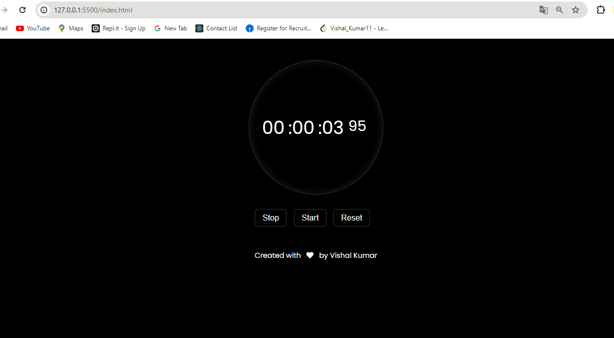

# Stopwatch

<p align="justify">This project is a simple stopwatch implemented using HTML, CSS, and JavaScript. The stopwatch displays hours, minutes, seconds, and milliseconds and includes buttons to start, stop, and reset the timer.</p>

## Features

- Start, stop, and reset the stopwatch
- Displays hours, minutes, seconds, and milliseconds

## Getting Started

To get a local copy up and running follow these simple steps.

### Prerequisites

You need a web browser to open the HTML file.

### Installation

1. Clone the repo

   ```sh
   git clone https://github.com/your_username/your_repository.git
   ```

2. Open the index.html file in your browser.

## Usage
- **Start:** Click the "Start" button to start the stopwatch.
- **Stop:** Click the "Stop" button to stop the stopwatch.
- **Reset:** Click the "Reset" button to reset the stopwatch to 00:00:00:00.

## Contributing
<p align="justify">Contributions are what make the open source community such an amazing place to learn, inspire, and create. Any contributions you make are greatly appreciated.</p>

1. Fork the Project
2.  Create your Feature Branch (git checkout -b feature/AmazingFeature)
3. Commit your Changes (git commit -m 'Add some AmazingFeature')
4. Push to the Branch (git push origin feature/AmazingFeature)
5. Open a Pull Request

## License
Distributed under the MIT License. See LICENSE for more information.

## Output Screen
- See the Stopwatch
